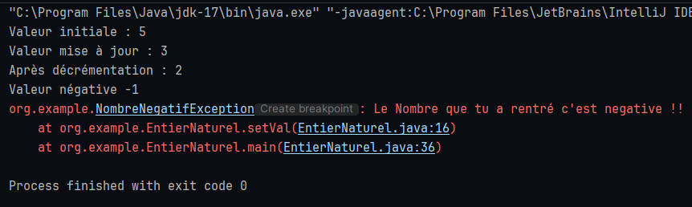
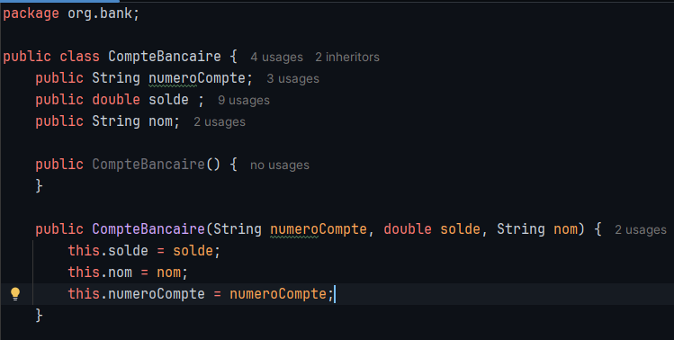
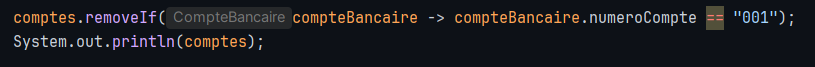
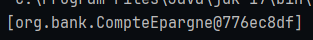
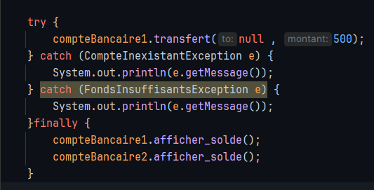
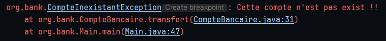
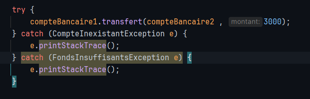
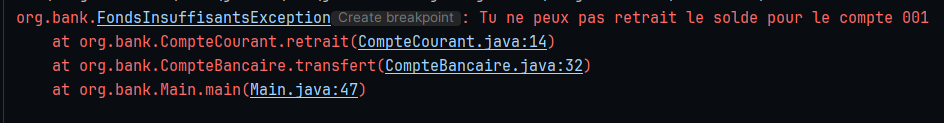

<div align="center">

# Exercice 1 : EntierNaturel

</div>

## Aperçu

L'application `EntierNaturel` comprend les éléments suivants :

1. **Classe : EntierNaturel**
    - Gère les entiers naturels (nombres non négatifs).
    - Inclut des méthodes pour lire, modifier, décrémenter et initialiser des valeurs.
    - Lève une exception personnalisée pour les opérations invalides impliquant des nombres négatifs.

2. **Exception Personnalisée : NombreNegatifException**
    - Spécialise la classe `Exception` de Java.
    - Stocke la valeur erronée ayant provoqué l'exception.
    - Fournit une méthode pour récupérer cette valeur.

---

## Détails des Classes

### EntierNaturel

- **Attributs :**
    - `val` : Un entier représentant l'entier naturel.

- **Constructeur :**
  ```java
  public EntierNaturel(int value) throws NombreNegatifException;
  ```
  Initialise `val`. Lève une `NombreNegatifException` si l'argument est négatif.

- **Getter :**
  ```java
  public int getVal();
  ```
  Retourne la valeur encapsulée.

- **Setter :**
  ```java
  public void setVal(int value) throws NombreNegatifException;
  ```
  Met à jour `val`. Lève une `NombreNegatifException` si l'argument est négatif.

- **Décrémenter :**
  ```java
  public void decrementer() throws NombreNegatifException;
  ```
  Diminue `val` de 1. Lève une `NombreNegatifException` si la valeur résultante est négative.

---

### NombreNegatifException

- **Attributs :**
    - `invalidValue` : Stocke la valeur erronée ayant provoqué l'exception.

- **Constructeur :**
    - Initialise l'exception avec le message et la valeur erronée.
      ```java
      public NombreNegatifException(String message, int val);
      ```
    - Initialise l'exception avec le message.
      ```java
      public NombreNegatifException(String message, int val);
      ```

- **Méthode :**
  ```java
  public int getValErronee();
  ```
  Retourne la valeur stockée.

---

## Exemple de Méthode Main

La méthode principale illustre l'utilisation de la classe `EntierNaturel`, y compris la gestion des exceptions
`NombreNegatifException`.

### Exemple de Code

```java
public static void main(String[] args) throws NombreNegatifException {
    try {
        EntierNaturel nombre = new EntierNaturel(5);
        System.out.println("Valeur initiale : " + nombre.getVal());

        nombre.setVal(3);
        System.out.println("Valeur mise à jour : " + nombre.getVal());

        nombre.decrementer();
        System.out.println("Après décrémentation : " + nombre.getVal());

        nombre.setVal(-1);

    } catch (NombreNegatifException e) {
        System.out.println("Valeur négative " + e.getValErronee());
        e.printStackTrace();
    }
}
```

---

## Screenshot pour le test

<div align="center">



</div>

<hr>
<hr>
<hr>


<div align="center">

# Exercice 2 : Gestion de Bank

</div>

## Fonctionnalités

1. **Classe de base `CompteBancaire`** :

    - Définie avec les attributs : numéro de compte, solde, nom du titulaire.
       <div align="center">

    
    
    </div>

    - Permet de :
        - Faire un dépôt.
          ```java
          public void depot(double solde_depot){
                this.solde += solde_depot;
            }
          ```
          - Effectuer un retrait avec gestion des fonds insuffisants via une exception personnalisée
            `FondsInsuffisantsException`.
          ```java
            public void retrait(double solde_retrait) throws FondsInsuffisantsException {
                if (this.solde < solde_retrait) throw new FondsInsuffisantsException("Tu ne peux pas retrait le solde pour le compte " + this.numeroCompte);
                this.solde -= solde_retrait;
            }
          ```
          - Afficher le solde.
            ```java
                public void afficher_solde(){
                    System.out.println("le solde de " + this.nom +" c'est : " + this.solde );
                }
            ```
          - Transférer de l'argent entre deux comptes avec gestion des exceptions pour fonds insuffisants ou compte
            inexistant.
            ```java
                public void transfert(CompteBancaire to,double montant) throws CompteInexistantException, FondsInsuffisantsException {
                    if ( to == null) throw new CompteInexistantException("Cette compte n'est pas exist !!");
                    this.retrait(montant);
                    to.depot(montant);
                }
            ```

2. **Sous-classes :**

    - `CompteCourant` : Permet un découvert autorisé.
    ```java
    public class CompteCourant extends CompteBancaire{
    private double overdraftLimit;
                    
    public CompteCourant(String numeroCompte, double solde, String nom, double overdraftLimit) {
        super(numeroCompte , solde, nom);
        this.overdraftLimit = overdraftLimit;
    }
                    
    @Override
    public void retrait(double solde_retrait) throws FondsInsuffisantsException {
        if (this.solde + this.overdraftLimit < solde_retrait) {
            throw new FondsInsuffisantsException("Tu ne peux pas retrait le solde pour le compte " + this.numeroCompte);
        }
        this.solde -= solde_retrait;
    }
    }
    ```
- `CompteEpargne` : Génère des intérêts.
    ```java
    public class CompteEpargne extends CompteBancaire {
        private double interestRate;
    
        public CompteEpargne(String numeroCompte, double solde, String nom, double interestRate) {
            super(numeroCompte, solde, nom);
            this.interestRate = interestRate;
        }
    
        public void genererInterets() {
            this.solde += this.solde * this.interestRate;
        }
    }
    ```

3. **Exceptions personnalisées :**

    - `FondsInsuffisantsException` pour gérer les tentatives de retrait ou transfert avec des fonds insuffisants.
    ```java
      public class FondsInsuffisantsException extends Exception {
   public FondsInsuffisantsException(String message) {
   super(message);
   }
   }
      ```
    - `CompteInexistantException` pour gérer les transferts vers des comptes inexistants.
    ```java
      public class CompteInexistantException extends Exception {
   public CompteInexistantException(String message) {
   super(message);
   }
   }
      ```

4. **Classe `Main` :**

    - Déclare une liste de comptes bancaires.
    ```java
    List<CompteBancaire> comptes = new ArrayList<>();
    ```
    - Permet d'ajouter et de supprimer des comptes.
    ```java
    comptes.add(new CompteCourant("001", 1000.0, "Anouar", 500.0));
    ```
    - Effectue diverses opérations (dépôt, retrait, transfert, génération d'intérêts).
    - Gère les erreurs avec des messages appropriés.

## Exemple d'Utilisation

1. **Ajout de comptes :**
   ```java
   comptes.add(new CompteCourant("005", 500.0, "Oussama", 200.0));
   comptes.add(new CompteEpargne("006", 1500.0, "Salah", 1.5));
   ```

2. **Dépôt et Retrait :**
    ```java
    CompteBancaire compteBancaire1 = comptes.stream().filter(compteBancaire -> compteBancaire.numeroCompte.equals("001")).findFirst().get();
    compteBancaire1.afficher_solde();
    compteBancaire1.depot(2000.0);
    compteBancaire1.afficher_solde();
    try {
        compteBancaire1.retrait(2000.0);
    } catch (FondsInsuffisantsException e) {
        System.out.println(e.getMessage());
    }finally {
        compteBancaire1.afficher_solde();
    }
    ```

3. **Transfert :**
   ```java
   try {
       compte.transfert(compteDestinataire, 200.0);
   } catch (Exception e) {
       System.out.println(e.getMessage());
   }
   ```

4. **Affichage des Soldes :**
   ```java
   compte.afficherSolde();
   compteDestinataire.afficherSolde();
   ```

## Résultats attendus (Screenshots)

### 1. Ajout de comptes

```java
CompteCourant nouveauCompte = new CompteCourant("007", 300.0, "Grace", 100.0);
```

### 2. Opérations de dépôt et retrait

```java
nouveauCompte.depot(150.0);
nouveauCompte.

retrait(400.0);
```

### 3. Transfert d'argent et Affichage des soldes

```java
    try {
        compteBancaire1.transfert(compteBancaire2 , 500);
    } catch (CompteInexistantException e) {
        System.out.println(e.getMessage());
    } catch (FondsInsuffisantsException e) {
        System.out.println(e.getMessage());
    }finally {
        compteBancaire1.afficher_solde();
        compteBancaire2.afficher_solde();
    }
```

## Résultats attendus (Screenshots)

### 1. Ajout de comptes

<div align="center">


</div>

### 2. Opérations de dépôt et retrait

<div align="center">


</div>

### 3. Transfert d'argent

<div align="center">


</div>

### 4. Affichage des soldes

<div align="center">


</div>

### 5. Supprimer Compte

<div align="center">




</div>

### 6. Exception de CompteInexistantException

<div align="center">




</div>

### 6. Exception de FondsInsuffisantsException

<div align="center">




</div>

